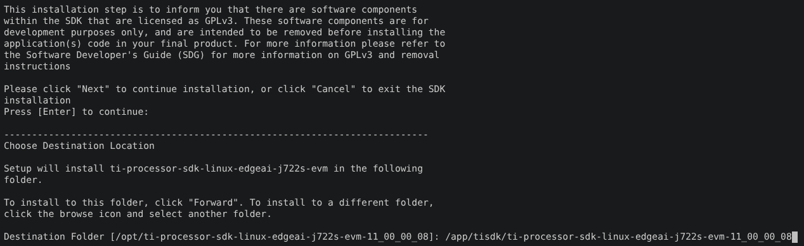

# Edge AI image builder

The main repository is located at the following link: [edge-ai-image-builder
](!https://openbeagle.org/beagleboard/edge-ai-image-builder/-/tree/main?ref_type=heads#edge-ai-image-builder).

A docker image was created in this repository to facilitate the build process.

## Working with docker

First of all, you need to build the docker image

```bash
./build_docker.sh 
```

Then you can enter your docker container
```bash
./run_docker.sh
```

## Building image

In your Docker container, you need to start building Linux:

```bash
./setup-sdk.sh
```
> Russian users need to use a VPN 

During the installation of the linux SDK, specify the appropriate path:

```bash
/app/tisdk/ti-processor-sdk-linux-edgeai-j722s-evm-11_00_00_08
``` 



After a successful build, you will have a ready-to-use Linux image for flashing SD-card:

```bash
edge-ai-image-builder/artifacts/beagleyai.img.xz
``` 


